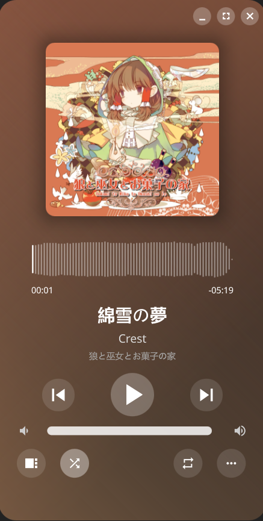

# MusicPlayer

## 简介

这是一个使用c++编写的小型本地音乐播放器，灵感来源于[amberol](https://gitlab.gnome.org/World/amberol)，因为amberol不支持在应用中显示歌曲，并且播放列表视图只有歌曲，没法做文件夹层次视图，所以就想着另起炉灶自己搓一个.jpg&emsp;&emsp;顺带也将这个项目作为学习ffmpeg和qml的练手项目了.png

因为周围的人没有写UI的所以UI部分仿照了[amberol](https://gitlab.gnome.org/World/amberol)的UI来进行设计，日后有重新构建一个独立的UI的想法，但短期内估计不会整。如果这样对作者本人造成了影响且本人不希望被模仿的话我会立即修改UI （真不会设计UI求放过（（

这个播放器支持Windows / Linux双端。使用ffmpeg库进行音频播放，使用taglib库进行音频标签的提取。播放列表支持直接以文件浏览器视图进行管理

播放器名字和logo还没想到，就暂定MusicPlayer和无logo吧（跑




## 功能(包括计划中的未完成的功能)

- [X] 封面显示
- [X] 随机播放
- [X] 循环控制
- [X] 音量调整
- [X] 播放列表以文件列表树结构构建
- [X] 播放列表中在当前正在播放的歌曲的右侧显示图标表示正在播放该曲
- [X] 递归在当前视图中搜索歌曲
- [X] 可以被系统媒体播放器控制（目前仅Linux下有效）
- [ ] 在播放列表中定位当前正在播放的歌曲
- [ ] 歌词显示
- [ ] 桌面歌词

## 🚀 快速开始

### Arch Linux

#### 编译步骤
``` bash
# 1. 安装依赖
sudo pacman -S qt6-base qt6-declarative qt6-multimedia qt6-tools ffmpeg sdl2 taglib sdbus-cpp pkgconf uchardet

# 2. 克隆项目
git clone https://github.com/MusicPlayer3/smallestMusicPlayer.git

# 3. 进入项目文件夹
cd smallestMusicPlayer

# 4. 配置构建
cmake -B build -DCMAKE_BUILD_TYPE=Release

#5. 编译项目
cmake --build build -j$(nproc)

#6. 运行程序
./build/appMusicPlayer
```

### Windows
（待施工）
